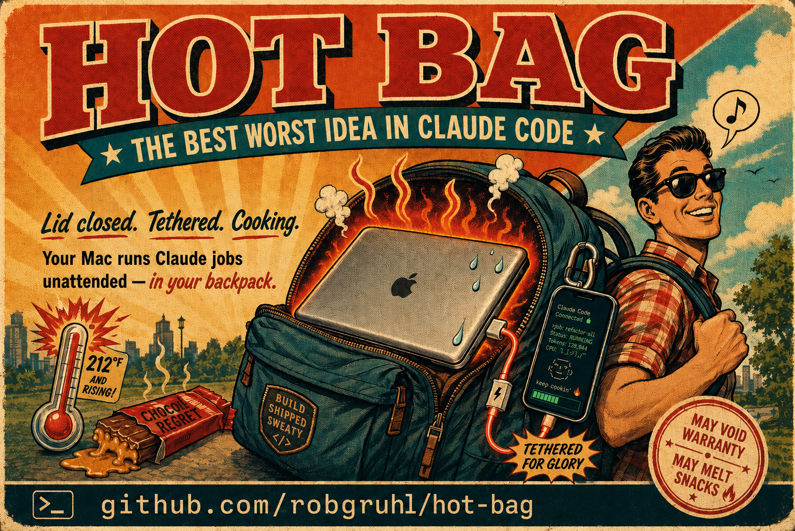

# hot-bag 🎒🔥



**Hot bagging** *(v.)*: kicking off a big Claude job, closing the laptop, and
running it in your backpack while you move.

You know that long-running Claude job you babysit at your desk? What if you
just… closed the lid, threw your MacBook in your backpack, tethered it to
your phone, and went outside like a person?

`hot-bag` keeps an **Apple Silicon Mac** running an unattended job while the
**lid is closed** and it's stowed in a bag — networked over your **phone's
tether**, powered by **battery or a USB-C power bank**, with **temperature,
battery, connectivity, and tether bytes logged every 30 seconds** so you get
a full health report when you stop. The real `pmset` magic, not just
`caffeinate` hopes and dreams. Always restores normal sleep on `stop`, so
your laptop doesn't become a pocket space heater forever.

> ⚠️ May void warranty. May melt snacks. May cause coworkers to ask why your backpack is humming.

```
hot-bag start     # before you close the lid
hot-bag status    # live reading, anytime (no sudo); shows data-used-so-far mid-run
hot-bag stop      # when the job's done — prints the run report
hot-bag report    # reprint the report for the latest run
hot-bag chime     # preview the 8-bit lid-close reminder sound
hot-bag doctor    # detect-and-repair a wedged state (see "If things get wedged")
```

---

## The 3-step routine

1. **Turn the tether on** (the one thing no command can do for you):
   - *USB tether (best for a backpack):* plug the phone in, enable **Personal
     Hotspot** (iPhone) or **USB tethering** (Android). Wired = no dropouts and
     the phone charges.
   - *Wi-Fi tether:* join the phone's hotspot once.
2. **Plug in the power bank** (recommended — see *Power* below).
3. `hot-bag start` → enter your sudo password once → close the lid → go.

When you're back: open the lid, `hot-bag stop`, read the report.

---

## What `start` actually does

1. **Waits for internet over *any* link** (USB tether / Wi-Fi / Ethernet) — it
   does not hard-require a specific interface. Reports which link is live.
2. `sudo pmset -a disablesleep 1` — the **hard clamshell override**. This is the
   only thing that keeps an Apple Silicon Mac awake with the lid shut. Plain
   `caffeinate` does **not** survive a lid close; we also run `caffeinate -dimsu`
   as a second layer.
3. Launches a **background watchdog** that samples every 30s into a CSV under
   `~/.local/state/hot-bag/runs/` — temperature, battery, connectivity, and
   **bytes used over the tether** (so the report tells you how much phone data
   the run burned).

`stop` reverses all of it (`disablesleep 0`, kills watchdog + caffeinate) and
prints the report.

---

## Resilience & transparent fallback

**Network.** macOS already fails over between links on its own: if you have both
USB tether and Wi-Fi up, it routes through whichever is available and switches
automatically. `hot-bag` doesn't fight that — it logs which interface is live
each sample so you can see drops/switches in the report. Optionally, set
`WIFI_SSID`/`WIFI_PASSWORD` (see *Config*) and the watchdog will actively try to
**rejoin that hotspot** whenever the link goes down.

**Power.** The clamshell override uses `pmset -a` (all power sources), so it
**works on battery** — you do not need to be plugged in. Switching between the
internal battery and a USB-C power bank is handled by the hardware; nothing to
configure. Every sample logs `battery_pct` and `power_source` so the report shows
your drain. Optional low-battery safety (`LOW_BATT_ACTION=sleep`) lets the Mac
sleep *gracefully* (state preserved) before a hard power-off — off by default so
it never pauses your job uninvited.

---

## Temperature on Apple Silicon — read this

Apple Silicon has **no built-in command that prints CPU degrees** (unlike Intel).
This tool gets real numbers from [`smctemp`](https://github.com/narugit/smctemp)
(installed via `brew tap narugit/tap && brew install smctemp`):

- **GPU °C** reads directly.
- **CPU °C** needs retry flags to get a stable reading; we use `-i25 -n40`.
- If `smctemp` isn't installed, temps log as `NA` and the tool falls back to the
  **CPU speed-limit** signal (`pmset -g therm`), which drops below 100% only when
  the OS is throttling from heat or power starvation.

Each sample is labelled from the hottest sensor: `OK → WARM (≥80°C) → HOT (≥90°C)
→ CRITICAL (≥95°C)`, plus `THROTTLED` if the CPU speed limit fell below 100%.
Thresholds are configurable.

The report ends with a plain-English **verdict** that puts those numbers in
context for the bag scenario — what the peak temp actually means, whether the
CPU ever throttled (and what that cost you), how the battery and network held
up, and one concrete suggestion for the next run. Bands are deliberately
tighter than "desk normal" because airflow, not silicon, is the limit when
the lid is shut in a bag.

---

## ⚠️ The real risk is thermal, not software

Lid closed + zipped bag = **no airflow**. Apple Silicon will run full-tilt with
the override on and can overheat, throttle, or emergency-shutdown in an insulated
bag. **Leave the bag open/unzipped and don't bury the laptop.** The report's
`HOT`/`CRITICAL` counts tell you after the fact whether you got away with it.

---

## Limiting tether data (don't blow the data plan)

Every run reports **how much data went over the tether** (`tether data : ↓ … ↑ …`),
measured from the interface's byte counters — a close proxy for the cellular data
your phone billed. It counts *all* traffic on the link, not just Claude.

When the lid's closed in the bag, Claude is the only thing *actively* using the
network — the surprise data drain comes from **background system daemons**
(iCloud sync, software updates, Photos analysis, Time Machine cloud, Spotlight).

**Recommended: Low Data Mode** on the tether network. It tells macOS and
cooperating apps to defer that background traffic while your active Claude API
calls keep flowing. It's cooperative (not enforced), zero-risk, and set-and-forget.

- **Wi-Fi hotspot:** join the phone's hotspot, then *System Settings → Wi-Fi →
  Details… (next to the hotspot) → Low Data Mode → on*. It's **per-SSID**, so it
  sticks to that hotspot for every future session.
- **USB tether:** Low Data Mode usually has no toggle for the USB network service
  (it's a Wi-Fi/Cellular feature). On USB, use a hard `pf` bandwidth cap instead
  (not yet wired into this script — see CLAUDE.md "future ideas").

macOS has **no built-in per-process bandwidth limit**. True "only Claude gets
out" requires a per-app firewall (LuLu / Little Snitch); a hard ceiling on the
whole tether requires `pf` + `dnctl` dummynet.

## Config

All optional. Set as environment variables, or copy `config.example` to
`~/.config/hot-bag/config` and edit:

| Var | Default | Meaning |
|-----|---------|---------|
| `INTERVAL` | `30` | Seconds between samples |
| `WARN_C` / `HOT_C` / `CRIT_C` | `80` / `90` / `95` | Temp thresholds (°C) |
| `PING_HOST` | `1.1.1.1` | Connectivity check target (tried first; falls back to 8.8.8.8, then an HTTP check to captive.apple.com) |
| `WIFI_SSID` / `WIFI_PASSWORD` | *(blank)* | Wi-Fi to auto-rejoin on drop |
| `LOW_BATT_ACTION` | `none` | `sleep` = graceful sleep when low on battery |
| `LOW_BATT_PCT` | `7` | Battery % that triggers the safety |
| `LID_CHIME` | `on` | Play an 8-bit sound when you close the lid mid-run (`off` to silence) |
| `LID_CHIME_FILE` | *(blank)* | Your own audio file to play instead of the built-in chiptune |
| `LID_CHIME_VOLUME` | *(blank)* | Playback volume `0.0`–`1.0` (blank = system volume) |
| `LID_CHIME_UNMUTE` | `on` | If muted, briefly unmute *just for the chime* and restore your exact state after (`off` = play into the mute) |

---

## Install

```bash
git clone <this repo> ~/Projects/hot-bag
cd ~/Projects/hot-bag
./install.sh                       # symlinks into ~/.local/bin (on your PATH)
brew tap narugit/tap && brew install smctemp   # for real °C (optional but recommended)
```

## Lid-close chime (🔊 the "don't forget me" beep)

When you shut the lid mid-run, hot-bag plays a short **8-bit chiptune** — a last
audible confirmation that it's still going before the Mac disappears into your
bag. On by default, no setup, no dependencies: the sound is a square-wave
arpeggio synthesized on the fly with `perl` and played with the built-in
`afplay`, and the lid is detected sudo-free via `ioreg` (`AppleClamshellState`).

Preview it any time:

```bash
hot-bag chime
```

The chime runs as a tiny background watcher lifecycled to the run — it starts
with `start`, stops with `stop`, and can never outlive the watchdog. Silence it
with `LID_CHIME=off`, swap in your own sound with `LID_CHIME_FILE`, or set
`LID_CHIME_VOLUME` (see *Config*).

**Muted?** By default (`LID_CHIME_UNMUTE=on`) hot-bag briefly unmutes *just for
the chime* and then restores your exact mute + volume — so you still hear the
reminder even if you'd muted for a meeting, without leaving your Mac unmuted
afterward. Set `LID_CHIME_UNMUTE=off` to respect the mute completely (the beep
fires silently).

## Menu-bar indicator (🔥 at a glance)

Want to know at a glance whether hot-bag is on? Install the optional menu-bar
indicator. It puts a small icon in the top bar:

- **🔥** — actively hot bagging (lid-close sleep disabled, watchdog running)
- **⚠️** — *wedged* (sleep override stuck on but no watchdog — run `hot-bag doctor`)
- *(nothing)* — off; the icon hides itself so it's only there when it matters

Click it for a quick menu: **Status…**, **Run doctor**, **Quit**.

```bash
./indicator/install.sh             # build + load (runs at login)
./indicator/install.sh uninstall   # remove it
```

It's a tiny native Swift menu-bar agent (NSStatusItem) launched by `launchd` —
**no third-party apps, no Homebrew, no Dock icon.** It owns no state of its own:
every poll shells out to `hot-bag _indicator-state`, the single source of truth,
so the icon can never disagree with `hot-bag status`. Built with the `swiftc`
that ships with the Xcode Command Line Tools (`xcode-select --install` if you
don't have them).

## Files

```
hot-bag           the script (start/stop/status/report/chime/doctor + internal _watch/_lidwatch)
install.sh        symlinks hot-bag into ~/.local/bin
config.example    optional config template
indicator/        optional menu-bar 🔥 indicator (Swift agent + LaunchAgent + installer)
runs/             per-run CSV logs (gitignored; lives in ~/.local/state/hot-bag/runs)
CLAUDE.md         architecture notes for AI-assisted debugging
```

## sudo

The only privileged action is the single `pmset -a disablesleep` call in
start/stop — you're prompted once each. **The watchdog is deliberately
sudo-free** so it runs unattended without a password. (The optional low-battery
graceful-sleep uses `sudo -n` and therefore needs a passwordless sudoers rule for
`pmset` to fire unattended; otherwise it no-ops.)

If you cancel the sudo prompt during `stop`, the script keeps cleaning up but
prints a loud error and exits non-zero — the clamshell override will remain on
until you run `sudo pmset -a disablesleep 0` yourself (or `hot-bag doctor`).

### Managed Macs / temporary admin (SAP Privileges)

On a managed Mac you're a *standard* user until you temporarily elevate (e.g.
via **Privileges.app**). hot-bag checks your admin status **before** it calls
`sudo`, so instead of sudo's unhelpful "this incident will be reported," you get:

```
! Needs temporary admin rights for: sudo pmset disablesleep
! You are a standard user right now (SAP Privileges).

  Elevate via Privileges now? [y/N] y
▸ Requesting admin via PrivilegesCLI…
✓ You are now admin (Privileges) — continuing
```

Answer `y` and hot-bag elevates you (via `PrivilegesCLI --add`), waits for it to
land, and continues. Answer `n` (or if Privileges isn't found) and it prints the
manual steps and exits *before* touching sudo. If `stop` can't elevate, it still
kills the watchdog/caffeinate and exits non-zero so you know the override is
still on — just re-run `hot-bag stop` (or `hot-bag doctor`) once you're elevated.

## Stray caffeinate after stop

On `stop`, after hot-bag releases its **own** `caffeinate`, it scans for any
other `caffeinate` processes still holding sleep open and explains each one —
whether it blocks lid-close sleep or only idle sleep, and whether it auto-expires
(`-t`). It does **not** touch them: a bare `pkill caffeinate` would kill your
terminal/editor/Claude sessions. To sweep the foreign ones anyway:

```bash
hot-bag stop --kill-stray-caffeinate
```

## If things get wedged

If a crash, force-quit, or canceled sudo prompt leaves the Mac in
"lid-closed-awake" mode without a running watchdog, `hot-bag status` will say so
explicitly. The fix:

```bash
hot-bag doctor                       # auto: restore sleep, sweep stale state
# or, by hand:
sudo pmset -a disablesleep 0         # restore normal lid-close sleep
```

`doctor` only acts on processes and state it can prove belong to hot-bag — it
checks `ps` before killing PIDs from the pidfiles, and it only flips
`disablesleep` back to 0 if the `SLEEP_GUARD` marker confirms hot-bag set it
(otherwise it warns and leaves the system alone, so it won't clobber a
`disablesleep` someone set deliberately outside hot-bag).
